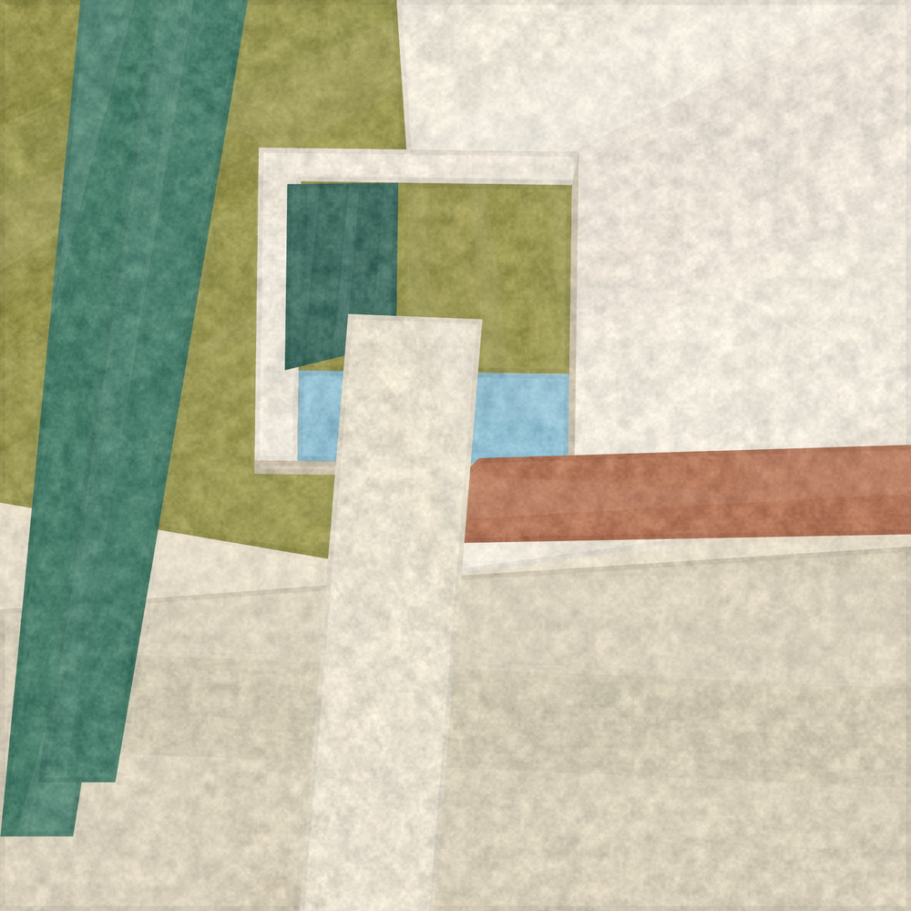
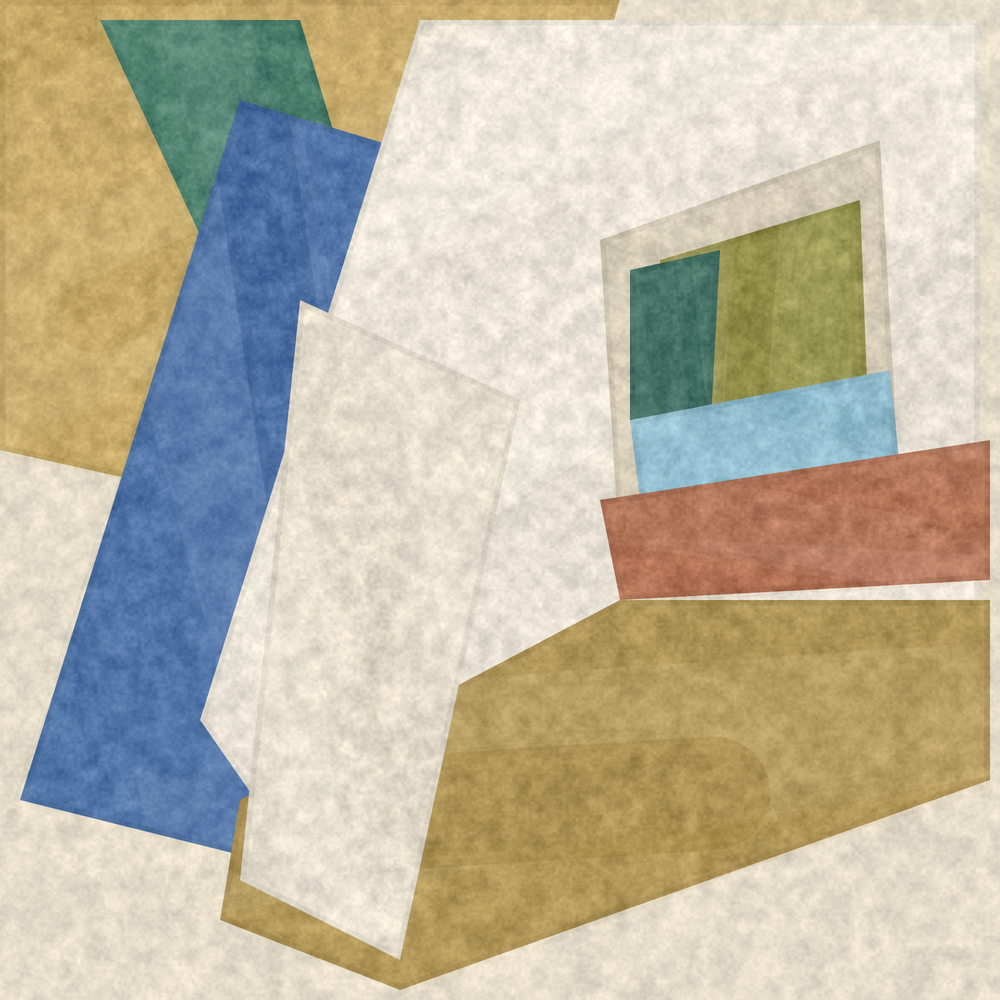
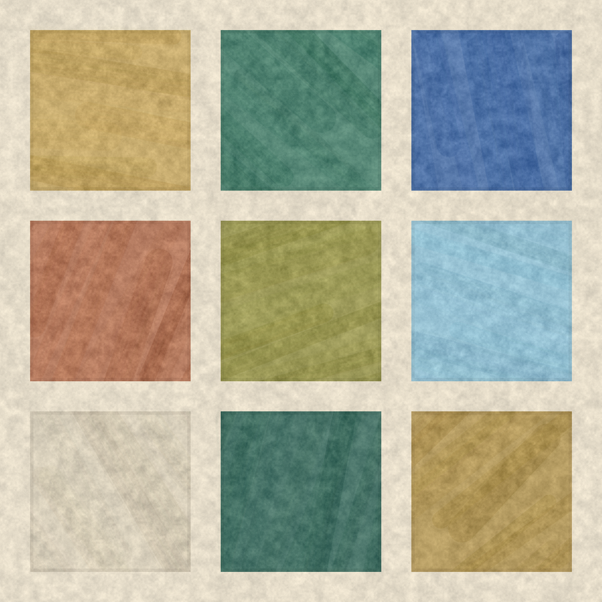
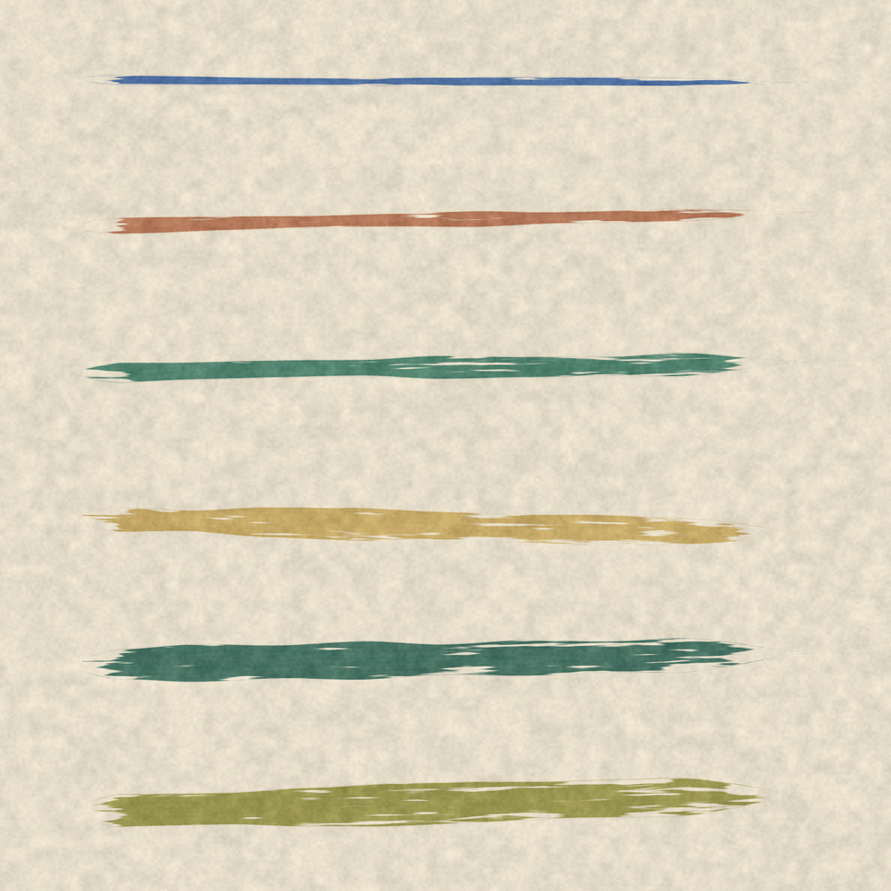

# Painterly Stroke Tool

用 p5.js 的 **2D canvas**（完全不用 WebGL / shader）重現壁畫、蛋彩（fresco / tempera）的顏料質感：
平整的幾何色塊，表面帶有礦物顏料吸收不均的雲斑、乾筆刷毛的痕跡，以及畫布的細顆粒。

**[▶ 線上試用](https://luyotw.github.io/painterly-stroke-2d/)** — 左側是畫布，右側可以即時調參數。



紋理分成幾個獨立的層，可以在介面上分別調整、或整層靜音：

| | |
|---|---|
|  |  |
| 幾何色塊構成的畫面 | 九種顏色的紋理測試板 |
|  | |
| 單筆乾擦筆觸 | |

## 檔案

| 檔案 | 用途 |
| --- | --- |
| `painterly.js` | 核心程式庫，唯一需要引入的檔案 |
| `sketch.js` | 展示與調參用的 sketch (四種模式) |
| `index.html` | 互動式 playground，附分組參數面板 |
| `render.html` / `render.js` / `ws-lite.js` | headless Chrome 批次輸出 PNG |
| `render-isolate.js` | 分離測試：一次只留一層紋理 |

## 快速開始

```bash
python3 -m http.server 8777
# 打開 http://localhost:8777/index.html
```

鍵盤：`1` 畫作 / `2` 色塊 / `3` 筆觸 / `4` 生成 ・ `R` 換 seed ・ `G` 顆粒 ・ `S` 存 PNG

## 用在自己的 sketch

```js
let brush;

function setup() {
	createCanvas(900, 900);          // 一般 2D canvas，不要 WEBGL
	brush = new PainterlyBrush(this, { seed: 12345 });
	noLoop();
}

function draw() {
	// 打底：帶紋理的牆面
	brush.ground('#e8e0cf');

	// 幾何色塊
	brush.fillPolygon(
		[[100, 100], [500, 60], [460, 520], [140, 480]],
		'#2b5fa8',
		{ angle: 0.4 }
	);

	// 單一筆觸
	brush.stroke(100, 700, 800, 690, '#ac6848', 40);

	// 收尾：套用斑駁 + 顆粒。一定要呼叫，否則色塊會停在平塗狀態。
	brush.finish();
}
```

## API

### `new PainterlyBrush(target, opts)`

`target` 是 `this` (主畫布) 或 `createGraphics(w, h)` 產生的 2D 圖層。
`opts` 可帶 `seed`，或直接覆寫下面任何參數。

### `brush.ground(color, {amount})`

鋪一層帶斑駁的底色，作為整張畫的基底。

### `brush.fillPolygon(points, color, opts)`

用「不透明底色 + 斑駁 + 乾筆筆觸」填滿多邊形。
`points` 接受 `[[x,y], ...]` 或 `[{x,y}, ...]`。

額外的 `opts`：

- `angle` — 筆觸方向 (radian)，不給則隨機
- `brushWidth` — 填色筆刷寬度 (px)

### `brush.stroke(x1, y1, x2, y2, color, width, opts)`

單一乾筆筆畫。由數十根獨立的刷毛線構成，每根有自己的濃度、粗細與飄移。

### `brush.pressureStroke(x1, y1, x2, y2, color, width, opts)`

沿路徑帶壓力變化、頭尾提筆與乾擦的單筆，末端會散成分岔的刷毛。
需要單獨的表現性筆觸時用這個，不要用 `stroke()`——後者端點是 `ROUND`，
會蓋出一個幾何上完美的半圓，看起來像蓋章而不是收筆。

**注意：** 乾擦是「把 `ground()` 記下的底色補回去」來製造空洞的，
不是真的把 alpha 清掉 (主畫布通常不透明，`destination-out` 會擦出黑色)。
因此乾擦的筆畫應該畫在底色上；若疊在其他色塊上，空洞會露出底色而不是下層的色塊。
不想要這個行為就把 `skipAmount` 設為 `0`。

### `brush.finish({grain})`

**收尾，必須呼叫。** 做兩件事：

1. 把 `fillPolygon()` 累積下來的斑駁一次套用完
2. 疊上整體顆粒 (傳 `{grain: false}` 可略過)

斑駁之所以延後到這裡，是因為色塊重疊處若被套用兩次，
亮度會和只套一次的地方對不起來，在 bounding box 邊界形成一道直的接縫。
統一在收尾階段依繪製順序處理，可保證每個像素只被套用一次。

### `brush.grain({amount, scale, x, y, w, h})`

只上顆粒。一般情況用 `finish()` 即可，這個留給需要自行控制流程的場合。

## 參數

質感分成兩件不同的事，不要混在一起調：

- **媒材** (`baseCoatMottle` 一族) — 石灰底 / 畫布本身的斑駁。
  它會**連續地跨過色塊邊界**，因為那是底材不是顏料。這一層要壓低，讓它退到背景。
- **筆觸** (`fillStrokeBody`、`fillBristleAlpha` 一族) — 顏料被刷上去的痕跡。
  這一層是主角，要看得出「這片顏色是一筆一筆刷出來的」。

讓筆觸看得見的關鍵有三個，缺一不可：

1. `baseCoat` 畫的是**比目標色亮**的底 (`baseCoatLift`)，真正的顏色靠上面的筆疊出來。
   底色若直接就是實色，後面不管怎麼刷都只是在實色上抹薄霧。
2. 每一筆都要有 `fillStrokeBody`（實際的顏料量），不能只有刷毛紋理。
   筆與筆互相蓋掉時的邊界，就是「這一筆刷到哪裡」。
3. 筆要**寬**、重疊要**少**。細筆高重疊會讓上百筆互相平均掉，結果又變回平塗。

質感由四層疊出來，調參時建議照這個順序：

### 1. 底色覆蓋 (決定「這是顏料」還是「這是線條」)

| 參數 | 預設 | 說明 |
| --- | --- | --- |
| `baseCoat` | `1` | 色塊底色不透明度 |
| `baseCoatLift` | `0.16` | 底色比目標色亮多少 |
| `baseCoatMottle` | `0.032` | 顏料濃淡斑駁的幅度 (媒材層) |
| `mottleMidScale` | `0.08` | 中頻雲斑，約 12px 一個斑 |
| `mottleFineScale` | `0.33` | 細頻粗糙感，約 3px |
| `mottleSpeckle` | `0.30` | 每像素顆粒的比重 |
| `planeVariation` | `0.35` | 每個色塊紋理參數的隨機變化幅度 |

頻率單位是 `1/px`。這裡**刻意沒有更低頻的參數**：一旦加入波長接近色塊尺寸的
成分，色塊內就會出現橫跨整片的明暗漸層，看起來像被打光的 3D 面，
而不是一片平塗的顏料。平面色塊在「平均值」上必須是平的。

同理，`ValueNoise2D.fbm()` 每一層之間會把座標系旋轉約 0.5 弧度。
若各層對齊在同一組軸上，會產生肉眼可見的方格狀結構——那是
「電腦雜訊」和「石灰壁」最明顯的差別。

### 2. 刷毛

| 參數 | 預設 | 說明 |
| --- | --- | --- |
| `strokeBody` | `0.85` | 單獨筆畫的核心不透明度。`fillPolygon` 內部會設為 `0` |
| `bristleDensity` | `0.9` | 每 px 筆寬幾根刷毛 |
| `bristleAlpha` | `0.045` | 單根刷毛的不透明度 |
| `bristleDropout` | `0.30` | 刷毛整根消失的機率，乾筆的關鍵 |
| `bristleJitter` | `0.35` | 刷毛位置抖動 |
| `bristleWaver` | `0.9` | 刷毛沿路徑的橫向飄移 (px) |

### 3. 筆畫路徑與壓力

| 參數 | 預設 | 說明 |
| --- | --- | --- |
| `pathWobble` | `1.6` | 筆畫中線彎曲量 (px) |
| `stepPx` | `2.2` | 路徑取樣間距，越小越細緻也越慢 |
| `pressureRange` | `0.45` | 壓力起伏幅度 |
| `liftEnds` | `0.12` | 頭尾提筆比例 |
| `skipAmount` | `0.45` | 乾擦強度：顏料咬不住紙面的比例 |
| `skipScale` | `0.05` | 乾擦的空間頻率 |

乾擦是 `pressureStroke()` 專屬的。雜訊在「筆畫座標系」取樣 (沿筆畫 / 垂直筆畫
兩個方向用不同頻率)，所以空洞會順著筆的方向拉長；若用畫布座標，空洞會是圓的，
看起來像蟲蛀而不是乾筆。筆畫末端 12% 會另外加一層橫向的細絲雜訊，
讓收筆散成幾根分岔的刷毛，而不是收成一個實心的尖或蓋出一個半圓。

### 4. 填色與收尾

| 參數 | 預設 | 說明 |
| --- | --- | --- |
| `fillStrokeBody` | `0.34` | **每一筆的顏料量 —— 筆觸可見度的關鍵** |
| `fillBristleAlpha` | `0.11` | 填色刷毛的濃度 |
| `fillOverlap` | `0.12` | 填色筆畫重疊比例 (大 = 糊成平塗) |
| `fillPasses` | `1` | 填幾層 |
| `fillPassAngle` | `0.28` | 層與層的角度差 (太大會變成規律網格) |
| `fillStrokeMinLen` | `0.3` | 最短的一筆佔多少比例 |
| `fillStrokeTone` | `0.09` | 每一筆的色調差異 |
| `edgeScuff` | `0.5` | 邊緣磨損強度，`0` 可得到全乾淨的硬邊 |
| `edgePool` | `0.10` | 邊緣內側的顏料堆積 |
| `edgePoolWidth` | `5` | 堆積寬度 (px) |
| `grainAmount` | `0.055` | 顆粒強度 |
| `grainScale` | `0.9` | 顆粒密度 |

## 決定性輸出

所有隨機都走內建的 mulberry32 PRNG，給同一個 `seed` 就會得到同一張圖，
不受 p5 全域 `randomSeed()` 影響，方便接 fxhash / Art Blocks。

若要接外部亂數源，直接傳 `rng`：

```js
new PainterlyBrush(this, { rng: () => fxrand() });
```

已驗證：同一個 seed 連續兩次輸出的 PNG 是 bit-identical 的。

## 效能

`fillPolygon` 與 `grain` 都有 per-pixel 的 pass。
在 900×900 @ `pixelDensity(2)` 下，一張含十來個色塊的圖大約需要數秒。
若要即時互動，可降低 `pixelDensity`，或把 `grain()` 留到最後才呼叫一次。

## 批次輸出

```bash
python3 -m http.server 8777      # 先開 server
node render.js                    # 輸出到 examples/
```

`render.js` 透過 CDP 直接驅動 headless Chrome，不需要任何 npm 套件。

## 授權

本專案程式碼以 MIT 授權釋出（見 `LICENSE`）。

`p5.min.js` 為 [p5.js](https://p5js.org/) 之發行版本，著作權屬 p5.js 貢獻者，
以 LGPL-2.1 授權，僅為方便離線使用而一併收錄。
